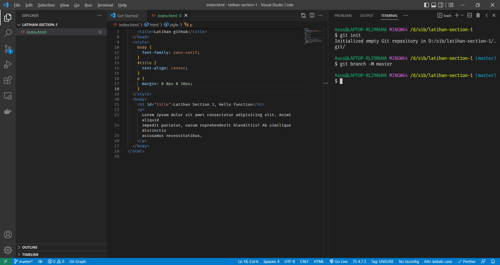
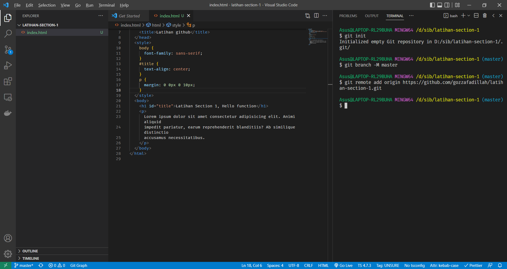
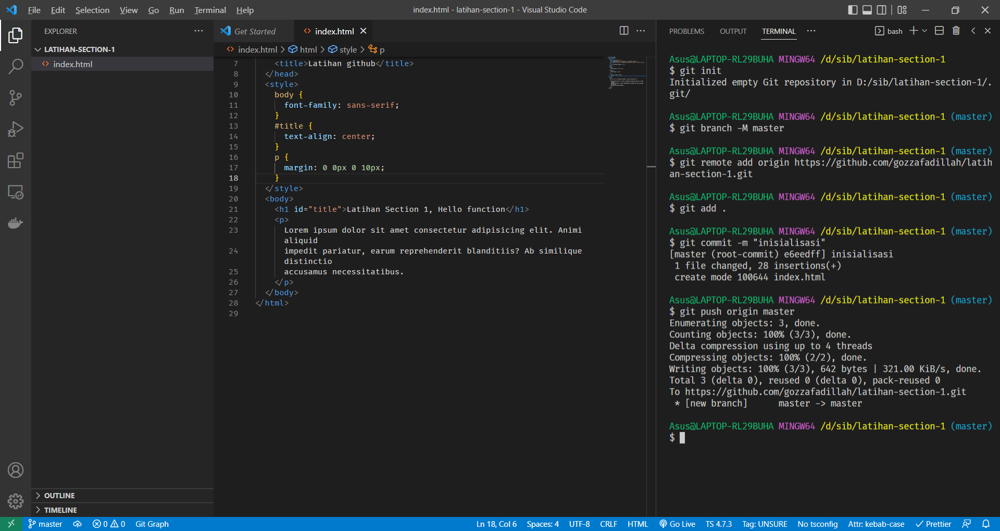
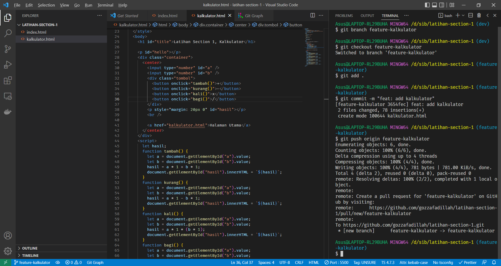
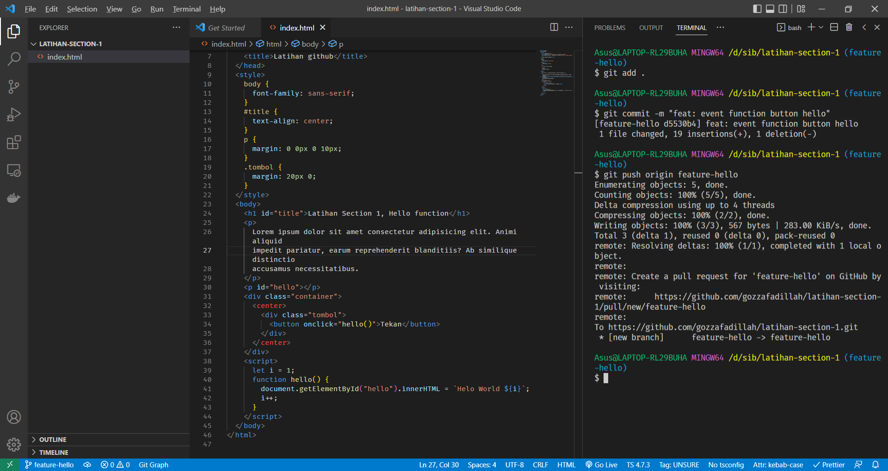
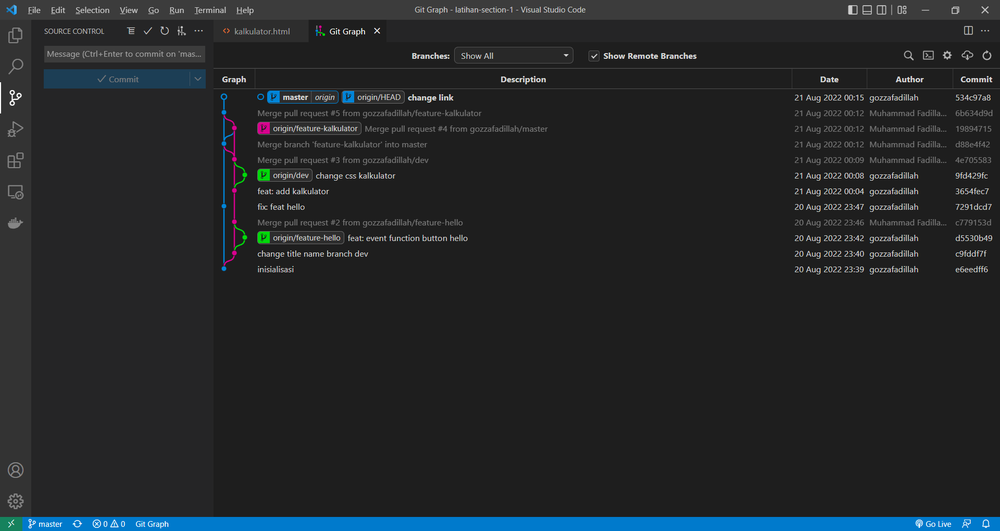
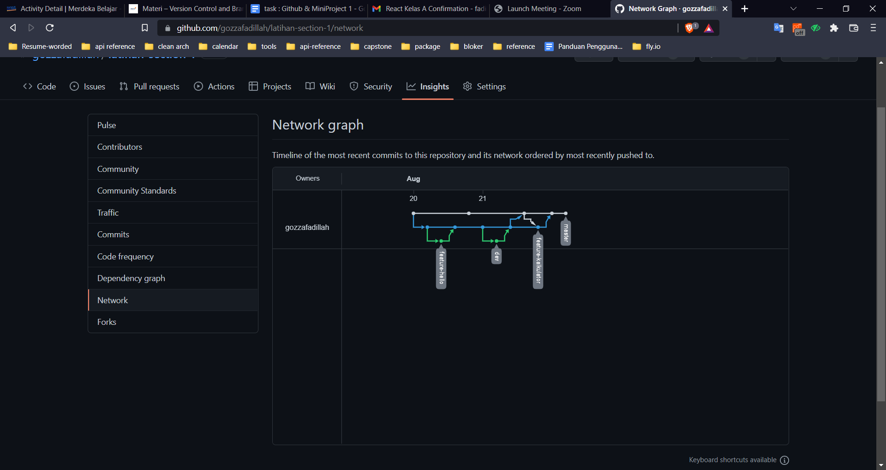

# Version Control and Branch Management (Git)

1. Git Version Control
2. Git Branch Management

## Git Version Control

Git version control merupakan sebuah fitur version control system (VCS) secara central dan secara terdistribusi. Git dapat membedakan antara version file hanya dari source code nya, jadi dapat di monitoring data yang telah diubah.

## Git Branch Management

Sebuah percabangan yang fungsinya untuk pembuatan entah itu penambahan fitur atau maintance yang bertujuan tidak mengganggu cabang (branch) origin / main / master.

## Git Stages

Berikut adalah alur dari perjalanan file kita dalam github :

`work directory -> Stages -> repository`

## 3 Poin yang saya dapatkan:

- Versioning, Merupakan interaksi antara project dengan tim dimana terjadinya sebuah revisi / perubahan. dalam versioning pada git bila ingin merubah versi ke sebelumnya tinggal di ubah dengan "git log --outline" disana kita dapat me reset secara soft atau hard ke versi yang salah atau tidak kepakai.
- Branching, Membuat cabang untuk mempermudah tahapan development. setiap development diwajibkan me-branch setidaknya lebih dari 2 agar file origin tersimpan aman dan bebas bug dari file yang sedang kita develop.
- Collaboration Workflow, meneruskan pemahaman saya dari branching disini kita menerapkan branching ke 4 branch berbeda. Ada main/master, development, featureA, featureB. Setiap programmer melakukan pembuatan feature tanpa harus merubah pada di file origin.

## Beberapa Tips yang harus dihindari :

1. Biar kan branch origin tidak terdistribusikan.
2. Hindari perubahan secara langsung di branch development apalagi di master.
3. Tidak boleh merge branch dari feature langsung ke main/master.
   Ketika semua dicek feature nya dan tidak ada bug maka pihak developer lah yang berhak merge ke main / master.

## Praktikum

link repository : [https://github.com/gozzafadillah/latihan-section-1](https://github.com/gozzafadillah/latihan-section-1)

1. Membuat folder praktikum section 1
2. Menginisialisasikan folder tersebut dengan `git init`
3. Membuat branch master `git branch -M master`
   
4. Remote repository yang sudah dibuat `git remote add origin <http repo>`
   
5. Push branch ke repo `git add .` dan `git commit -m <message` dan `git push origin <branch>`
   
6. Membuat branch dev `git branch dev`
7. Setelah itu buat branch feature-hello dan branch feature-calculator
   
   
8. lalu merge dari features ke branch dev `git merge feature-calculator` dan `git merge feature-hello`
9. Berikut git workflow nya dan network graph nya
   
   

```

```
