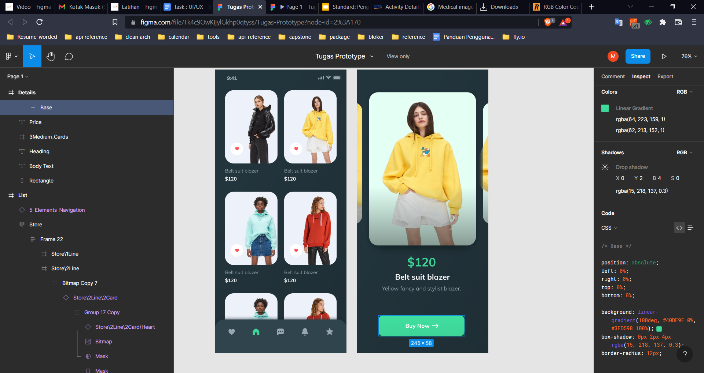
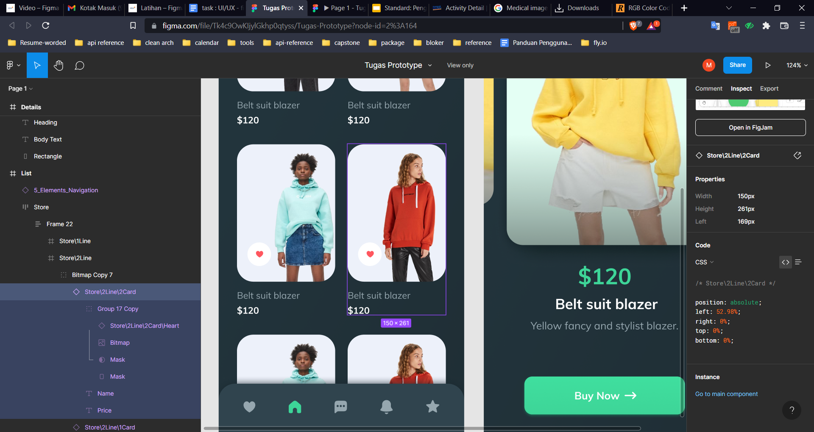
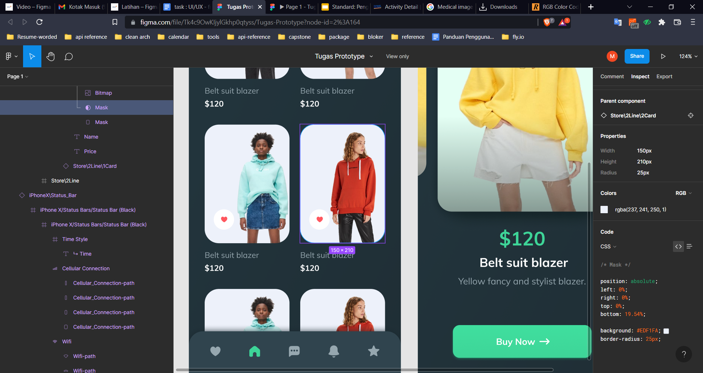

# Figma

## Apa itu Figma

Figma merupakan aplikasi untuk membuat kerangka design website atau mobile app. Aplikasi ini merupakan aplikasi wajib bagi UI/UX Designer. Keunggulan Figma adalah gratis walau pun sedikit terbatas.

## Keunggulan Figma

1. gratis
2. Dapat menambahkan assets bahkan plugins

## Kekurangan Figma

1. Harus tetap online
2. Walau gratis tetap terbatas

## Praktikum

1. Tugas pertama menganalisa button "Buy Now !"

- warna : `rgba(64, 223, 159, 1) `
- shadow : `box-shadow: 0px 2px 4px 0px rgba(15, 218, 137, 0.3)`
- background : linear-gradient(180deg, #40DF9F 0%, #3ED598 100%)
- box-shadow : 0px 2px 4px
- border-radius: 12px

2. Tugas kedua menganalisa card

- Width : 150px
- Height : 261px
- Radius : 25px

