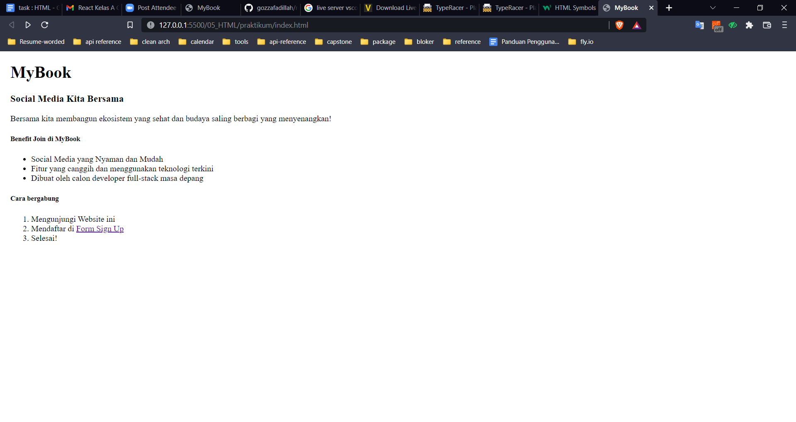
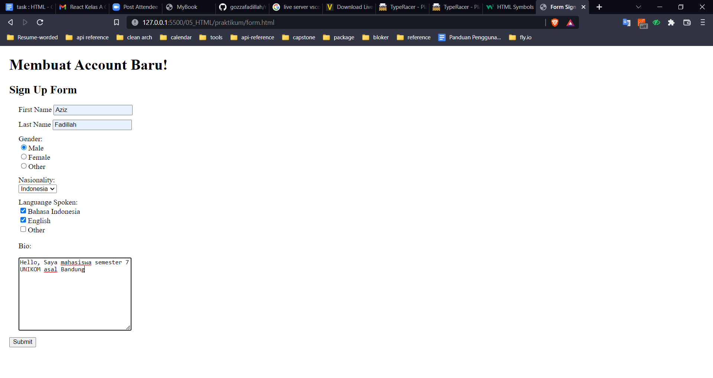
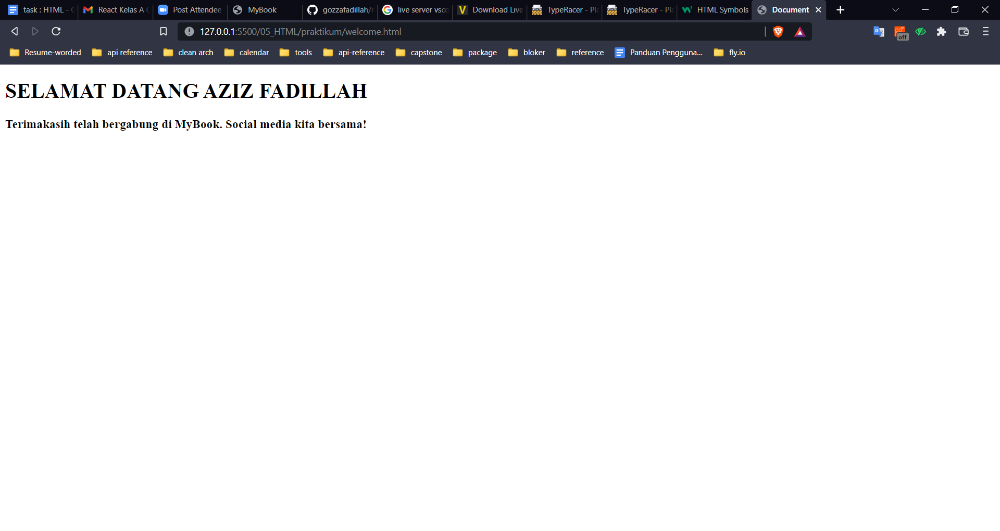

# HTML

## Apa itu HTML

HTML (Hyper Text Markup Language) merupakan bahasa standar pemogramman yang digunakan untuk merancang desain sebuah website.

## Tags HTML

Tags HTML terdiri dari :

1. Heading yang terdiri dari 6 tingkatan contohnya h1/h2/h3.../h6
2. Paragraft/ tags HTML ` 
`
3. Typogrspy Bold `<strong`, Italic `<em>`, dan Underline `<u>`
4. UL (Unorder List) dan OL (Ordered List)
5. Div / Span
6. Table
7. BlockQuote

dan masih banyak lagi.

## Praktikum

1. Membuat file index.html yang isi nya seperti berikut
   
   lalu membuat anchor sign up yang mengarahkan ke form.html
2. Dalam form.html saya membuat seperti ini
   
3. Setelah user submit akan di redirect ke welcome.html
   
