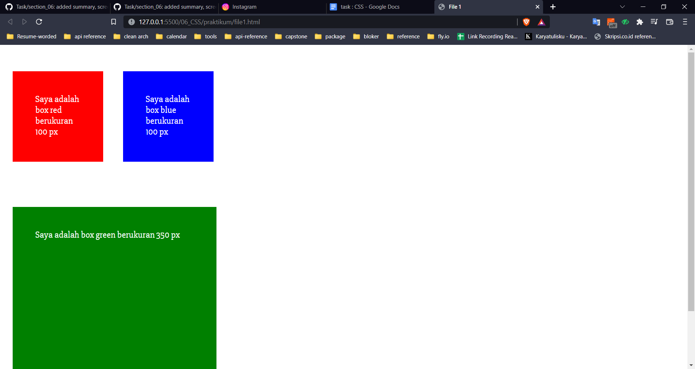
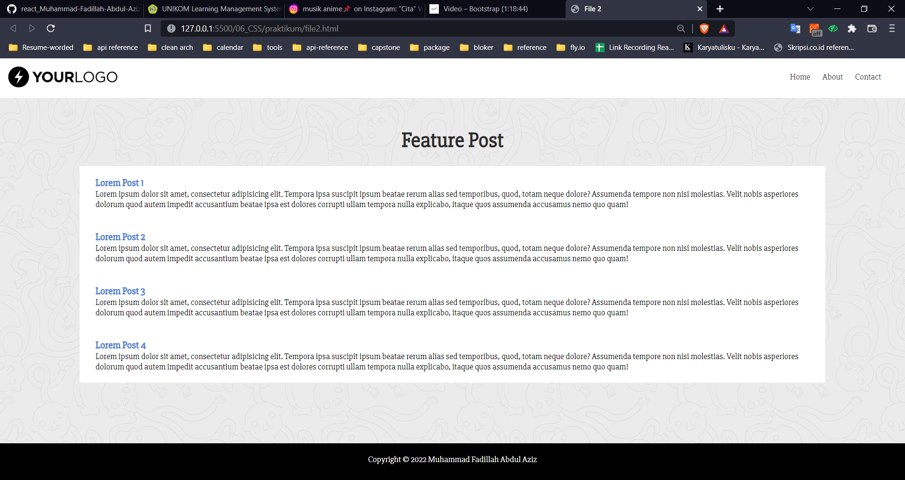

# CSS

## Apa itu CSS

CSS (Cascading Style Sheets) merupakan standar untuk menghias halaman website berupa HTMl dari color, size, margin, padding, background, dan lain sebagainya. Selain menghias CSS dapat untuk mengatur display dari letaknya. Contohnya, float, align, inline, block, dan grid.

## Cara menggunakan CSS

ada 3 cara menggunakan CSS :

1. External CSS
2. Internal CSS
3. Inline CSS

## CSS selector

CSS selector berfungsi sebagai identifikasi bagian mana yang harus dirubah. ada beberapa contoh selector, yaitu:

1. Tags

   ```
   css h1{
   color: red;}

   ```

2. id

```
    #nav {
        margin: 10px 20px;
        background-color: white;
    }
```

3. class

```
    .nav {
        margin: 10px 20px;
        background-color: white;
    }
```

## Praktikum Section 06

1. file1.HTMl
   
2. file2.HTMl
   
