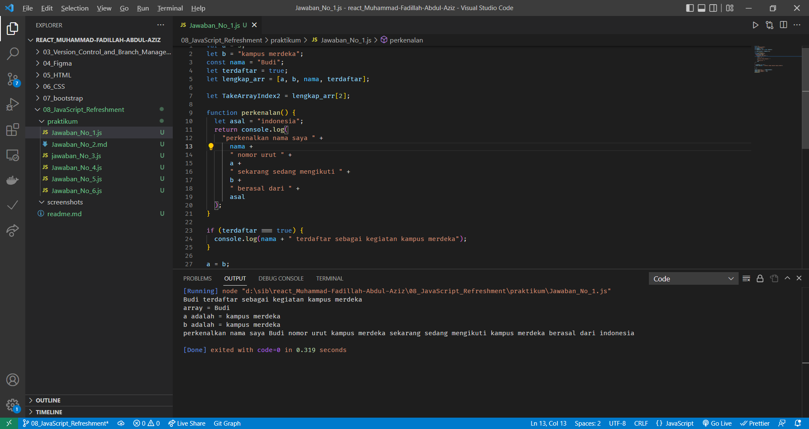
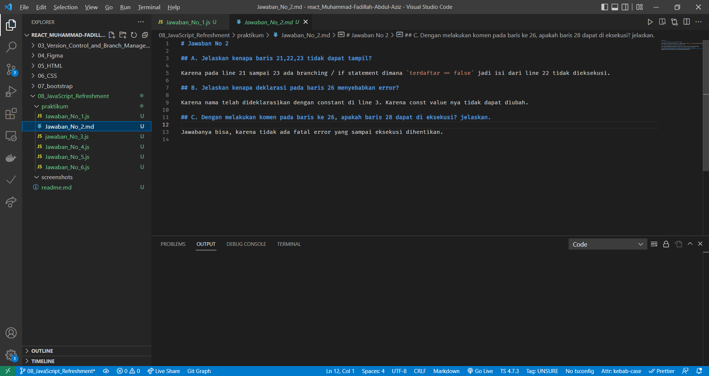
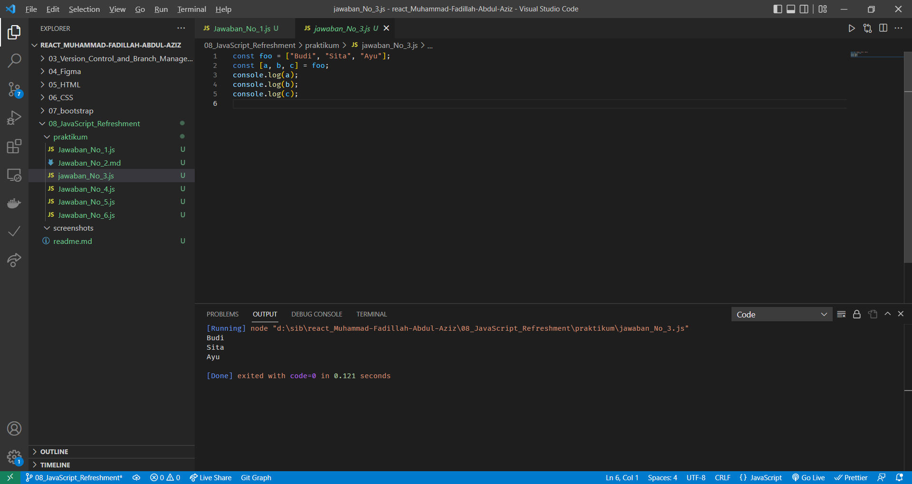
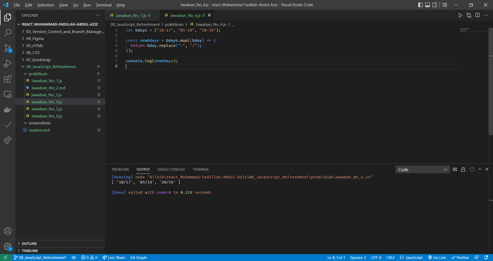
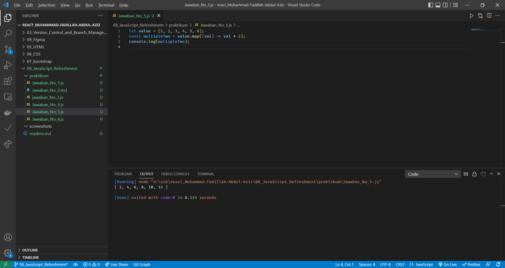
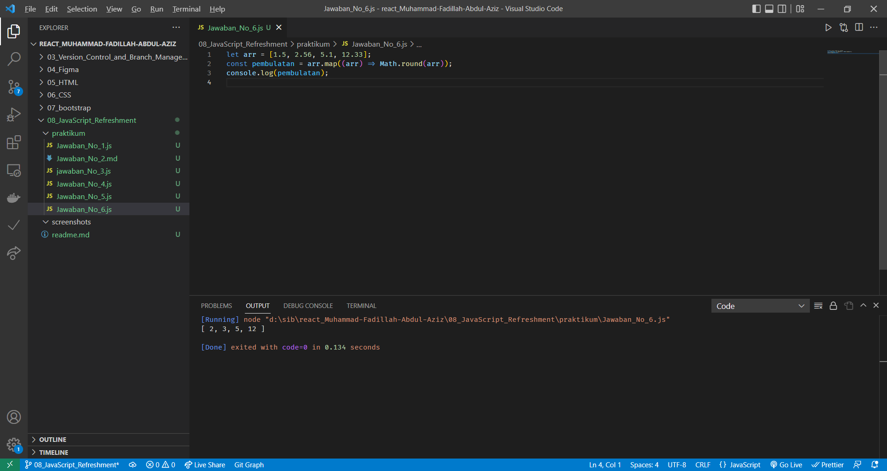

# JavaScript Refreshment

## Daftar

1. [Apa itu JavaScript](#apa-itu-javascript)
   - [Javascript Declaration](#apa-itu-javascript)
   - [JavaScript Scoping](#javascript-scoping)
   - [JavaScript Hoisting](#javascript-hoisting)
   - [Javascript Value](#javascript-value)
   - [Javascript Destructuring](#javascript-destructuring)
   - [Javascript Spread](#javascript-spread)
   - [Javascript Method](#javascript-method)
   - [Javascript Flow](#javascript-flow)
   - [Javascript Function](#javascript-function)
   - [Async - Await](#async-await)
   - [Callback](#callback)
   - [Promise](#promise)
   - [Await](#await)
   - [Class](#class)
   - [DOM](#dom)
2. [Praktikum](#praktikum)

## Apa itu JavaScript

JavaScript merupakan bahasa pemograman high level scripting untype dan Interpreted. JavaScript merupakan jenis bahasa pemograman dynamic.

### JavaScript Declaration

Cara mendeklarasikan variable di JavaScript ada 3 Cara:

1. `var name = "Budi"` mendeklarasikan varibale dengan var, hanya saja sudah jarang digunakan
2. `let name = "Budi"` mendeklarasikan variable dengan let
3. `const name = "Budi"` mendeklarasikan dengan const, beda nya const value nya tidak dapat diubah.

[Back](#daftar)

### JavaScript Scoping

ketika kita mendeklarasikan variable ada juga scopingnya, contohnya :

1. Scoping global
2. Scoping function
3. Scoping block

[Back](#daftar)

### JavaScript Hoisting

Hoisting intinya kita mengisi sebuah variable sebelum dideklarasikan, contohnya

```JavaScript
a = "aziz";
var a;

console.log(a)

<!-- output "aziz" -->

Hello()

function hello() {
    console.log("Hello world")
}

<!-- output "Hello world" -->
```

itulah mengapa kita developer tidak menggunakan var takutnya hoisting dan membuat bug pada codingan. Jadi lebih disarankan menggunakan `let`

[Back](#daftar)

### JavaScript Value

JavaScript value terdiri dari tipe data primitif dan tipe object

- Tipe Data Primitif :

  ```JavaScript
   let status = true
  ```

- Tipe Data Obejct :

```JavaScript
let data = {
firstNama: "Fadillah",
lastName: "Abdul Aziz"
}
```

[Back](#daftar)

### JavaScript Destructuring

Destructuring merupakan memindahkan data array ke dalam variable baru, lebih jelas nya seperti berikut :

```JavaScript
let arr = [1,2,3];
const [a,b,c] = arr;

console.log(a);
console.log(b);
console.log(c);

```

[Back](#daftar)

### JavaScript Spread

Memasukan semua data array atau object menjadi semacam daftar, contoh lebih lanjut seperti berikut

```JavaScript
let arr = [1, 2, 3];
let Users = {
    firstName: "Muhammad Fadillah",
    lastName: "Abdul Aziz",
    email: "gozzafadillah",
};

// spread array
const newData = [...arr];
// spread object
let newUser = { ...Users };

console.log(newData);
console.log(newUser);

```

[Back](#daftar)

### JavaScript Method

Method merupakan fungsi yang terkait dengan object, membuat program lebih sederhana. contohnya

1. Concat
2. Map
3. Foreach
4. Slice
5. Filter
6. Reduce

[Back](#daftar)

### JavaScript Flow

Saat program JavaScript dieksekusi itu dari atas ke bawah atau kiri ke kanan secara berurutan.

Macam-macam control Flow

- Looping (For, While, Do While)
- If statement (If ... Else, Switch, Block, Try ... Catch, Break, Continue, dan Trow )

[Back](#daftar)

### JavaScript Function

Function/fungsi merupakan object karena memiliki properti dan method.
Function digunakan untuk melakukan serangkaian prosedur yang dapat digunakan berulang kembali.

Deklarasi Function/Fungsi

```JavaScript
// function default
let hello = function () {
  console.log("hello world");
};

// Arrow Function
let Perkenalan = (nama) => {
  console.log(`halo ${nama} saya belajar di alterra`);
};

let Perkalian = (a, b) => {
  let hasil = a * b;
  return console.log(`hasil = ${hasil}`);
};

hello();
Perkenalan("aziz");
Perkalian(4, 5);

/* output
hello world
halo aziz saya belajar di alterra
hasil = 20
*/
```

[Back](#daftar)

### Async - Await

- Syncronous mengeksekusi setiap perintah satu persatu sesuai urutan kode yang ditulis.

```JavaScript
    console.log("Mulai eksekusi");
    console.log("Proses");
    console.log("Eksekusi berakhir");
```

- Asyncronous hasil eksekusi atau output tidak selalu berdasarkan urutan kode, tetapi berdasarkan waktu proses.

```JavaScript
    console.log("Mulai eksekusi");
    setTimeOut(() -> {console.log("Proses")}, 1800);
    console.log("Eksekusi berakhir");
```

[Back](#daftar)

### Callback

Callback adalah fungsi yang dieksekusi setelah fungsi lain setelah dijalankan.

```JavaScript

let Luas = (panjang, lebar) => {
  return panjang * lebar;
};

let Ukuran = (a, b, callback) => {
  let luas = callback(a, b);
  if (luas >= 100) {
    return "besar";
  } else {
    return "kecil";
  }
};

console.log(Ukuran(10, 10, Luas));

```

[Back](#daftar)

### Promise

Promise adalah object yang mempresentasikan keberhasilan atau kegagalan pada sebuah event yang Asyncronous dimasa mendatang.

- Asyncronous Promise
  1. Resolve, promise terpenuhi ` .Then()`
  2. Reject, promise tidak terpenuhi `.Catch()`
  3. Finally, promise proses selesai (optional)

Asyncronous Function sebuah function yang berkerja secara Asyncronous yang menghasilkan promise sebagai return value, tetapi secara penulisan yang Syncronous (Standar).

[Back](#daftar)

### Await

Await adalah sebuah keyword yang terdapat pada Async function yang tujuannya menghentikan eksekusi sambil menunggu promise selesai.

```JavaScript
function Test() {
  return new Promise((resolve, reject) => {
    let aktif = true;
    if (aktif) {
      setTimeout(() => {
        resolve("users aktif");
      }, 2000);
    } else {
      setTimeout(() => {
        reject("users sedang tidak aktif");
      }, 2000);
    }
  });
}

let testing = async () => {
  try {
    let hasil = await Test();
    console.log(hasil);
  } catch (error) {
    console.error(error);
  }
};

testing();

```

[Back](#daftar)

### Class

class adalah prototype dari sebuah object yang akan kita buat

- Constructor, adalah method di dalam class yang akan selalu terpanggil pertama kali ketika membuat object
- Method, adalah sebuah fungsi yang berada di dalam class
- Atributes, adalah kumpulan variable yang membentuk object yang dimiliki oleh sebuah class
- Extend, digunakan untuk membuat kelas anak / Inheritance dari parent.

```JavaScript
class Mobil {
  constructor(nama, cc) {
    this.nama = nama;
    this.cc = cc;
  }
  tampilkan() {
    return `Mobil ${this.nama}, memiliki kapasitas ${this.cc}`;
  }
}

class Toyota extends Mobil {
  constructor(nama, cc, tipe) {
    super(nama, cc);
    this.tipe = tipe;
  }
  tampilkan() {
    return `Mobil ${this.nama}, memiliki kapasitas ${this.cc} bertipe ${this.tipe}`;
  }
}

const supra = new Mobil("supra", 4800);
const avanza = new Toyota("avanza", 1300, "SUV");

console.log(supra.tampilkan());
console.log(avanza.tampilkan());

/* output
Mobil supra, memiliki kapasitas 4800
Mobil avanza, memiliki kapasitas 1300 bertipe SUV
*/

```

[Back](#daftar)

### DOM

DOM (Document Object Model) adalah API untuk HTML yang mempresentasikan halaman web pada suatu dokumen menjadi sebuah object.

DOM selection Method
| Event | Kegunaan |
| --- | --- |
|getElementById()| Element |
|getElementByTagName()| HTML Collection |
|getElementByClassName()|HTML Collection|
|querySelector()|Element|
|querySelectorAll()|Node List|

[Back](#daftar)

## Praktikum

Soal link : [https://docs.google.com/document/d/1Ke6H5HerrxYGt6QuDHtCCbqQwPUFcgGLoFI1a0n-6D8/edit](https://docs.google.com/document/d/1Ke6H5HerrxYGt6QuDHtCCbqQwPUFcgGLoFI1a0n-6D8/edit)

1. Jawaban Soal No 1
   
2. Jawaban Soal No 2
   
3. Jawaban Soal No 3
   
4. Jawaban Soal No 4
   
5. Jawaban Soal No 5
   
6. Jawaban Soal No 6
   
