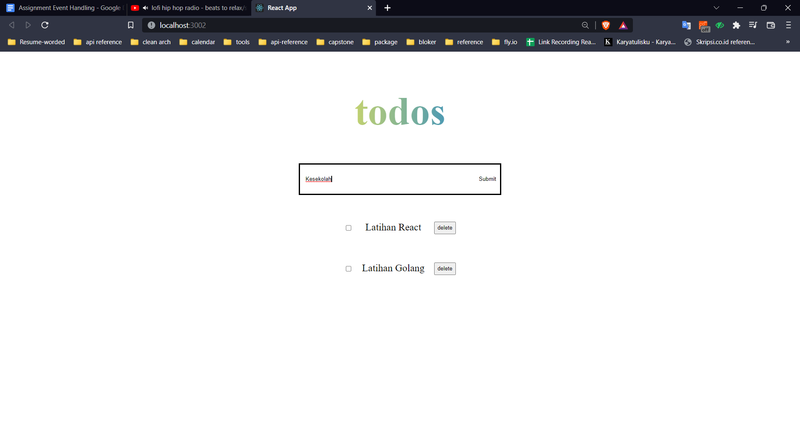
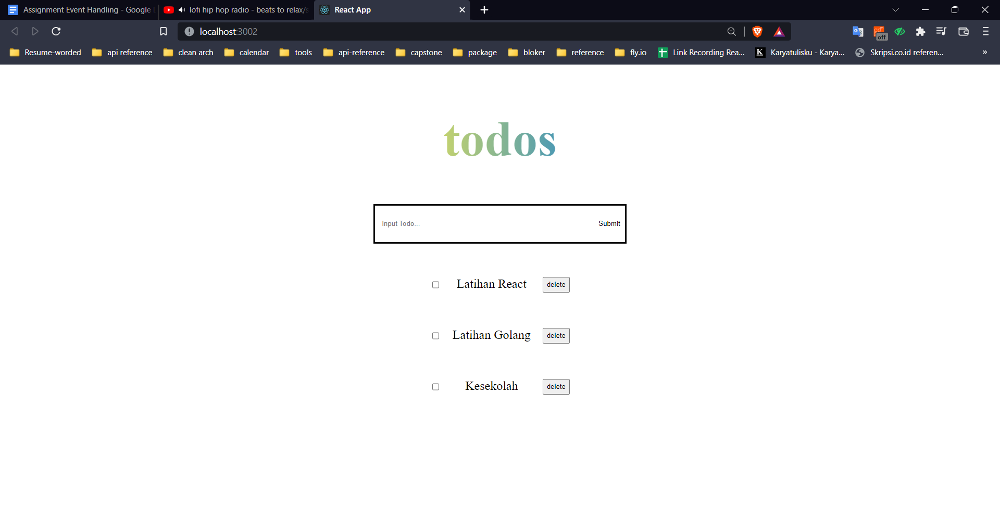
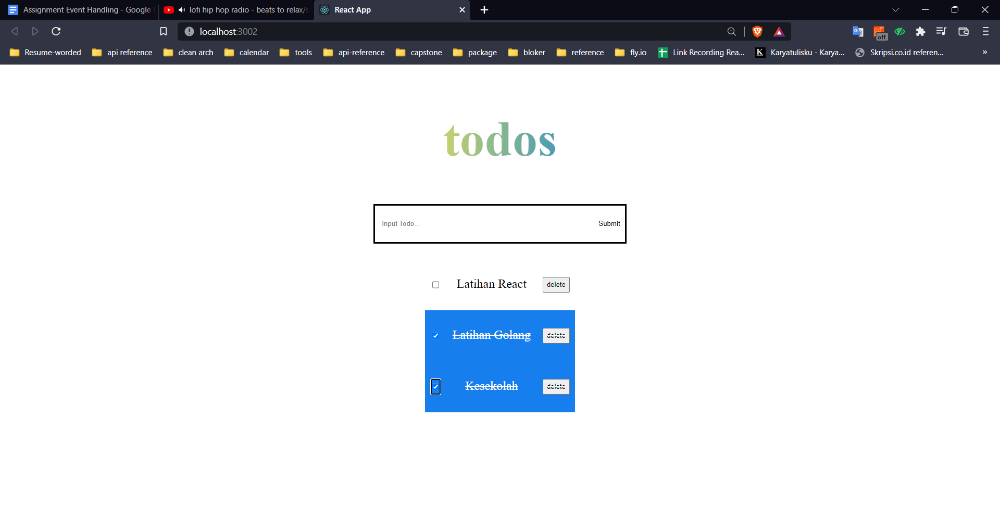
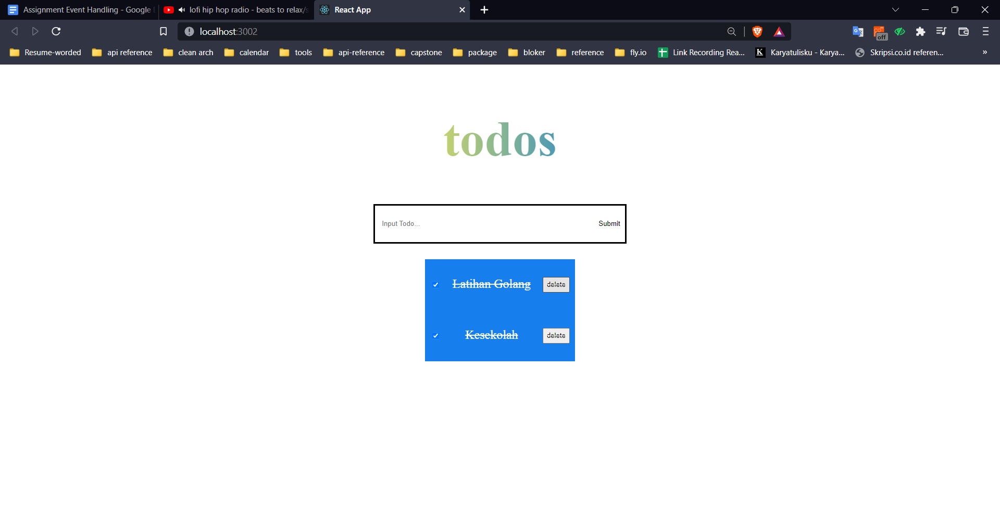

# Event Handling

## Event Handling

merupakan suatu metode untuk menangani sebuah event yang diberikan pada suatu komponen. Event adalah peristiwa yang terjadi ketika user berinteraksi dengan komponen. Contoh event adalah clipboard, form, mouse, dan generic.

## Tipe komponen:

| Stateless Component                              | Stateful Component                         |
| ------------------------------------------------ | ------------------------------------------ |
| Tidak tahu tentang aplikasi                      | Mengerti tentang aplikasi                  |
| Tidak melakukan data fetching (pengambilan data) | Melakukan data fetching (pengambilan data) |
| Tujuan utamanya adalah visualisasi               | Berinteraksi dengan aplikasi               |
| Dapat digunakan kembali                          | Tidak dapat digunakan kembali              |
| Hanya berkomunikasi dengan induk langsungnya     | Meneruskan status dan data ke anak-anaknya |

## Komponen stateful

memiliki state. State merupakan data private sebuah komponen sehingga tidak dapat diakses dari komponen lain. Ciri-ciri state adalah data tersebut dapat dimodifikasi dengan memakai setState, setiap perubahan data akan membuat render ulang, bersifat asynchronous, dan dipakai dalam class.

Props dan state itu berbeda, tapi kita dapat menggunakannya secara bersamaan dalam membangun suatu komponen. Props bersifat read only dan tidak dapat dimodifikasi, sedangkan state dapat diubah secara asynchronous serta dapat dimodifikasi menggunakan setState.

## Praktikum

1. Tampilan Todo App yang telah saya bangun
   
2. Tambah data kedalam Array object menggunakan setState
   
3. Check Todo yang telah dilaksanakan/sudah selesai
   
4. Hapus data array
   
