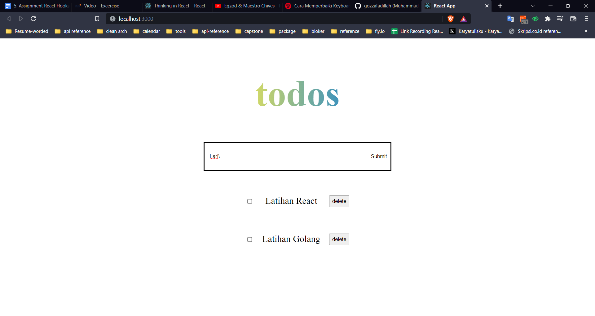
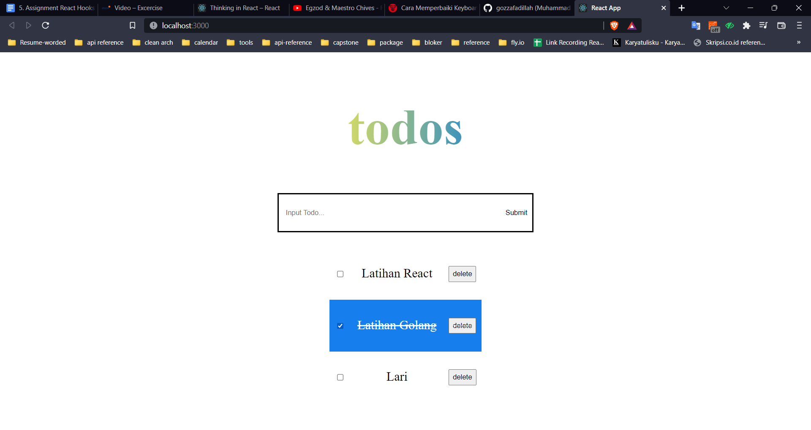
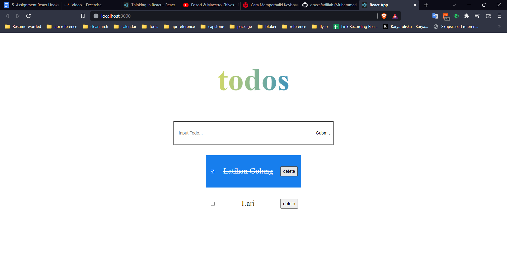

# React Hook

React Hook memungkinkan kita untuk membuat serta mengubah state tanpa menggunakan class. Dengan menggunakan react hook, kita dapat dengan lebih mudah untuk mengelola dan membaca codingan kita karena menggunakan functional programming. React Hook dasar yang sering digunakan adalah useState, useEffect, serta useContext.

Aturan pada hooks:

- Hanya panggil hooks di tingkat atas
- Hanya panggil hooks dari fungsi-fungsi react

### Custom Hooks

Kita dapat membuat hook sendiri yang memungkinkan kita dapat membuat komponen logic yang reusable

### useState

useState memungkinkan kita untuk melacak state dalam komponen function. useState memiliki dua nilai yaitu nilai saat ini dan function yang dapat mengupdate nilai state

- useEffect

useEffect memungkinkan kita untuk melakukan side-effect pada komponen. contohnya adalah mengambil data, memperbarui DOM secara langsung, atau pengatur waktu. useEffect menerima dua argumen yaitu function dan dependency, namun untuk argumen kedua ini bersifat opsional.

### Praktikum

Mengubah class component dari essay section 13 ke functional component dengan react hook
berikut setelah merubah dari class component ke functional component

1. Menambah data todo
   
2. Hasil dari menambah data
   
3. Checkbox bila todo telah selesai
   
4. Menghapus todo bila selesai
   
