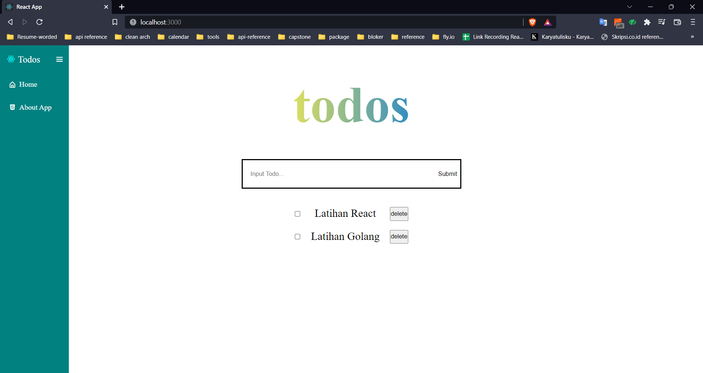

# React Routing

Website yang menggunakan React akan bersifat Single Page Application (SPA) yang artinya seluruh kode React hanya akan ada dalam satu page yaitu index.html. Cara menginstall react router dengan cara berikut:

```
npm install react-router-dom --save
```

React Router dapat dibagi menjadi 4 komponen, yaitu:

1. BrowserRouter yang digunakan sebagai wadah router yang nantinya dapat merepresentasikan lokasi aplikasi. BrowserRouter menggunakan API history sehingga dapat menggunakan lokasi untuk menyingkronkan UI dengan URL
2. Switch yang digunakan untuk membungkus kumpulan Route. Prinsipnya mirip dengan switch pada javascript yaitu mencocokkan argumen kemudian jika tidak cocok akan dilempar suatu komponen yang biasanya berupa page not found.
3. Route digunakan sebagai pengatur path pada suatu aplikasi web. Atributnya berisi path yang merupakan url browser saat routing, atribut component berisi komponen yang akan dirender saat mengakses path tersebut.
4. Link digunakan untuk berpindah antar halaman. properti to berisi url dari page yang ingin dituju.

Kita dapat menggunakan **parameter URL.** Jika kita memiliki URL /movie/titanic dan /movie/spiderman, maka kita perlu menulis path dalam router seperti ini

```jsx
<Route exact path="/users/:id" component={UsersComponent} />
```

Parameter URL berguna untuk menciptakan paginasi, sort n filter data, pencarian, dan menggambarkan.

## Hook Routing React

- **useHistory**: memberi akses ke instance riwayat yang dapat digunakan untuk bernavigasi.
  | Property | Kegunaan |
  | --------- | ------------------------------------------------------------------ |
  | length | (angka) Jumlah entri dalam tumpukan riwayat |
  | go | (fungsi) Memindahkan penunjuk di tumpukan riwayat sebanyak n entri |
  | goBack | (fungsi) Setara dengan go(-1) |
  | goForward | (fungsi) Setara dengan go(1) |
  | push | (fungsi) Mendorong entri baru ke tumpukan riwayat |
  | replace | (fungsi) Mengganti entri saat ini di tumpukan riwayat history |
- **useLocation:** mengembalikan objek lokasi yang mewakili URL saat ini. konsepnya mirip dengan useState
- **useParams:** mengembalikan objek berisi key dan nilai URL. Digunakan untuk mengakses match.params dari Route saat ini.
- **useRouteMatch:** mencocokkan URL saat ini sama dengan cara seperti <Route>.

## Praktikum

1. Membuat Tampilan home merupakan halaman TodoPages
   
2. Membuat sidebar dimana dalam sidebar terdapat navigation ke home, about profile, dan about author.
3. Berikut tampilan dari About App
   
4. Berikut tampilan dari About Author
   
5. Berikut tampilan dari error 404 notfound
   
