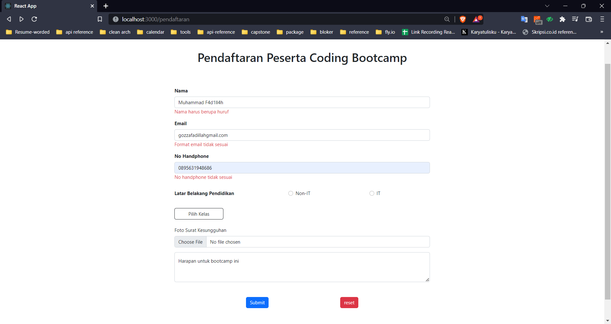
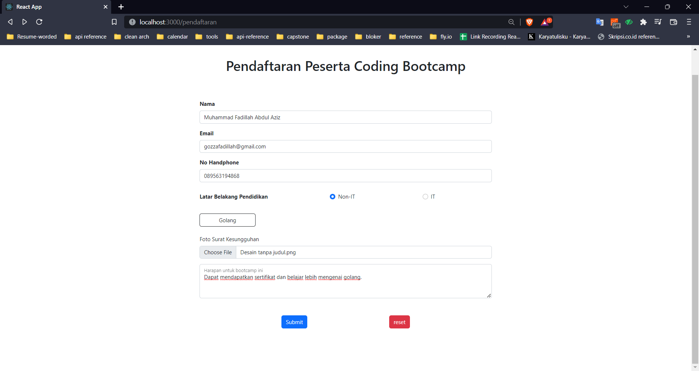
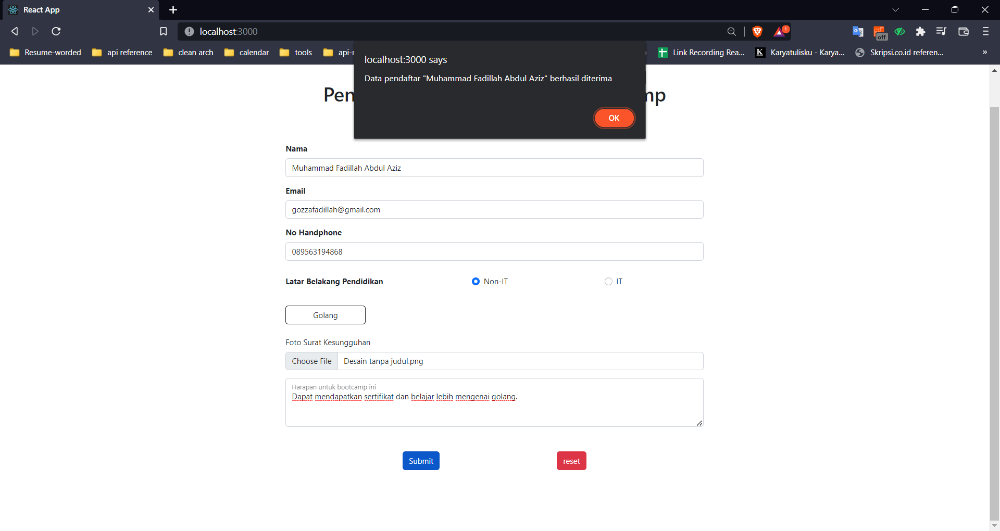
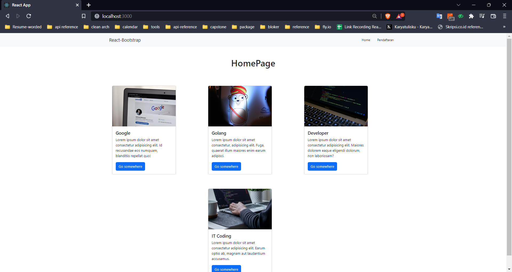

# React Form

## Apa itu React Form ?

Form merupakan elemen yang biasa digunakan untuk menangani input dari user. Contohnya pada sign up, login, comment, upload feeds instagram, dll.

Jenis input yang biasa digunakan dalam form adalah:

- text: untuk menerima inputan text
- Password: menerima inputan password
- number: hanya menerima inputan angka
- date: untuk mengimput data tanggal
- select: menawarkan inputan yang sudah kita tentukan
- radio: memilih salah satu opsi yang ditawarkan
- checkbox: memilih beberapa opsi yang ditawarkan
- button: tombol untuk mentrigger suatu aksi
- file: untuk menginput file (gambar, dokumen, dll)

## Controlled Vs Uncontrolled Component

> Uncontrolled: tidak mengontrol input dalam form, cara memperoleh nilainya melalui modules useRef. Bisa dibilang kita hanya mengambil value saat dibutuhkan saja.

> Controlled: setiap melakukan perubahan dalam, kita memanggil fungsi onChange untuk mengubah statenya. Dengan menggunakan teknik ini kita dapat melakukan validasi pada input sebelum disubmit

| Element  | Value property       | Change Callback | New value in callback |
| -------- | -------------------- | --------------- | --------------------- |
| text     | value="string"       | onChange        | event.target.value    |
| checkbox | checked={boolean}    | onChange        | event.target.checked  |
| radio    | checked={boolean}    | onChange        | event.target.checked  |
| textarea | value="string"       | onChange        | event.target.value    |
| select   | value="option value" | onChange        | event.target.value    |

## Validation

Ada dua tipe validasi:

- Validasi client side menggunakan fitur validasi HTML atau menggunakan code javascript
- Server side: validasi sebelum masuk ke database, biasanya setelah user menekan submit.

Yang saya pelajari pada kali ini adalah menerapkan kode javascript dan menggunakan atribut HTML untuk validasi. Validasi menggunakan atribut required, minlength, maxlength, min, max, type, dan pattern. Validasi javascript dapat diterapkan ketika kita memanggil fungsi seperti onChange, onClick, onSubmit, dll.

# Praktikum

1. Membuat form validasi pada nama, email, dan nomor telepon. Berikut tampilannya apabila tidak valid
   
2. Berikut tampilan keseluruhannya apabila user mengimputkan data lengkap. Saya membuat validasi apakah seluruh data diisi atau tidak. Apabila ada yang kosong maka tombol submit didisable.
   
3. Berikut alert apabila berhasil diinput tanpa issue
   
4. Karena saya membuat validasi pada tombol submit maka alert gagal submit tidak tertriger, tapi tetap saya buat didalam codingan saya. Oleh karena itu saya membuat tampilan pemanis apabila user telah submit data maka user akan redirect ke halaman utama.
   
