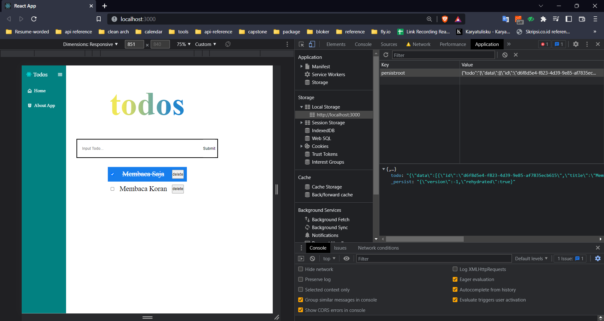
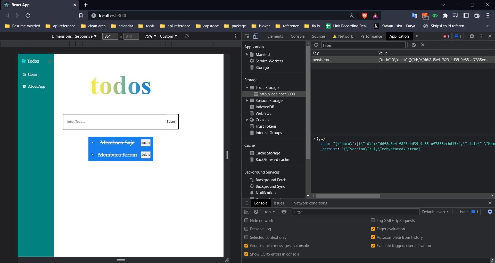
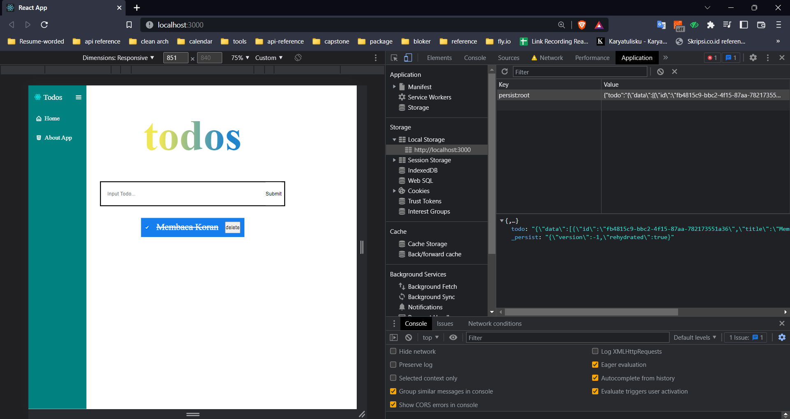
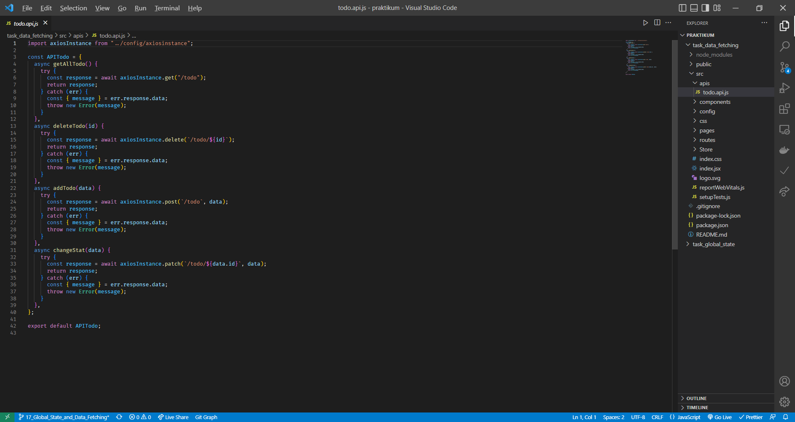
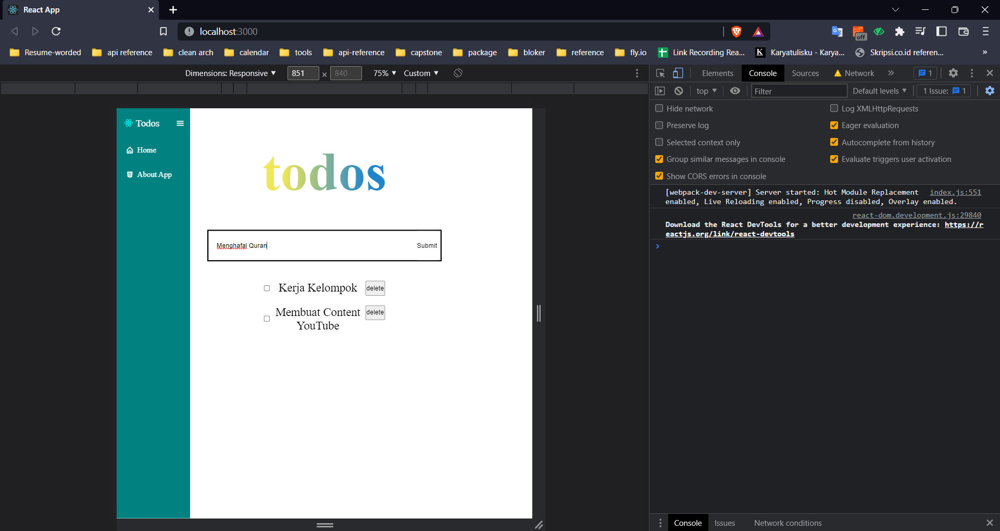
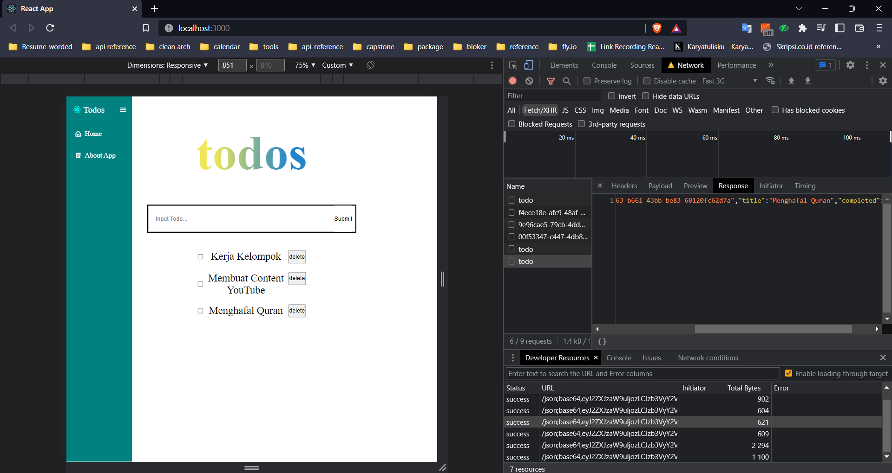
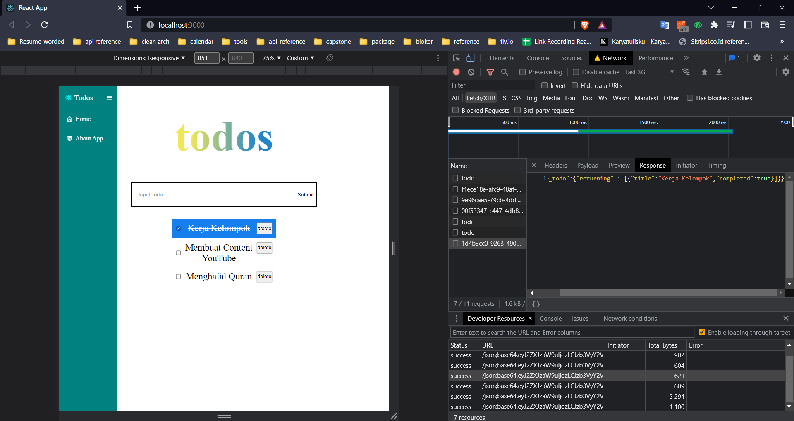
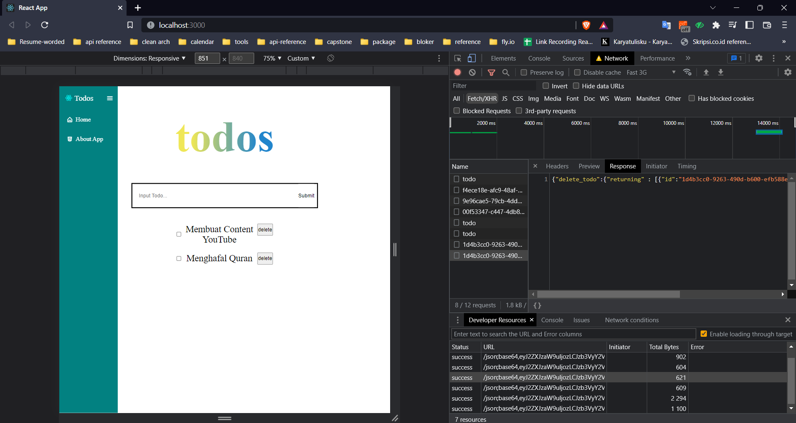

# Global State Management dan Data Fetching

## Global State Management

Perubahan data state pada react harus bergerak dari atas ke bawah, namun sayangnya sistem ini kurang efisien untuk aplikasi yang menggunakan banyak state. Oleh karena itu muncul konsep global state management. Tools yang saat ini sering digunakan adalah Redux.

Redux tepat untuk digunakan ketika:

- Banyak state yang perlu ditaruh di banyak tempat
- State pada app sering berubah
- Logic untuk mengubah state kompleks
- Ukuran codebase yang sedang-besar, dan dikerjakan oleh banyak orang
- Perlu untuk mengetahui bagaimana state diupdate seiring dengan waktu

Redux libraries dan tools:

- React redux
- Redux toolkit

Komponen penting:

- Action: memberikan informasi dari aplikasi ke store
- Reducer: functions yang mengambil state aplikasi saat ini dan object action lalu mengembalikan state aplikasi terbaru
- Store: objek sentral yang menyimpan state pada aplikasi

## Redux Thunk

Thunk middleware memungkinkan kita untuk membuat action creator yang mengembalikan function bukan action. Redux thunk berguna untuk menghandle side effect logic seperti logic synchronous kompleks yang perlu mengakses store dan juga async seperti request data.

## React Persist

Untuk menyimpan data pada local storage

## Data Fetching

Menarik data dari API

caranya melalui:

- Fetch API
- Axios
- React Query Library

## Praktikum

1. Membuat global state dan redux presist

- tampilang pertama saat todo app dibuka
  
- tampilan saat memasukan data
  
- mengubah todo completed dari false ke true atau sebaliknya
  
- menghapus data todo yang telah selesai
  

2. essay data fectching menggunakan rest api hasura

- berikut apis yang telah diconfigurasi dalam axios
  
- tampilan fetching data dari api
  
- menambahkan data dan melakukan post data ke hasura
  
- checklis data yang telah completed dan pasing ke hasura agar diubah statusnya
  
- delte data todo yang ada di hasura
  
