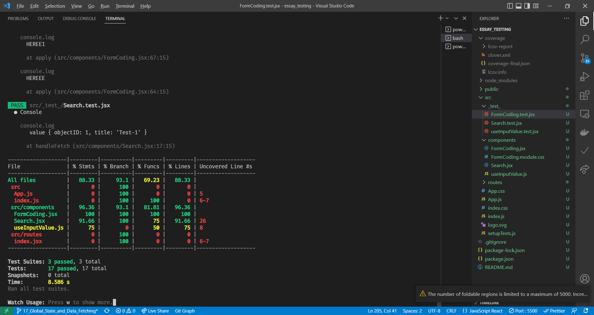
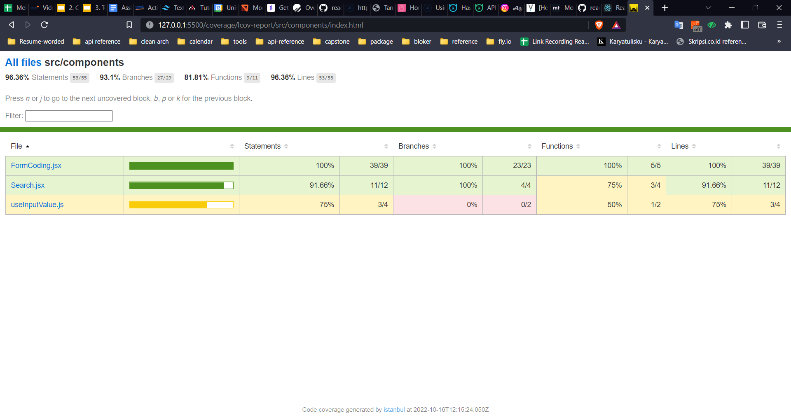

# Summary Testing

**Testing** merupakan proses memverifikasi kode kita apakah sudah berjalan dengan baik atau belum. Test assertion dalam testing bernilai boolean yaitu benar atau salah.

**Manfaat testing:**

- Mengurangi bug pada aplikasi
- Membuat code lebih aman untuk dimanipulasi

**Kategori:**

- Rendering component tree: tes rendering komponen
- Menjalankan aplikasi lengkap: tes keseluruhan aplikasi

**Perimbangan tools testing**:

- Kecepatan iterasi vs environment yang realistis
- Jumlah mock

**Tools testing:**

- Jest:
  test runner pada js yang memungkinkan kita untuk mengakses dom melalui jsdom. Jest memiliki kecepatan iterasi yang bagus dan dapat dikombinasikan dengan fitur lainnya sehingga kita memiliki kontrol yang lebih
- React Testing Library
  helpers untuk mengetes komponen react tanpa bergantung pada detail implementasinya. RTL akan memudahkan refactoring dan menerapkan best practice

## Testing Menggunakan RTL

Testing menggunakan RTL dapat digunakan untuk 4 jenis tes

1. Render dan Debug
   digunakan untuk berinteraksi dengan komponen sehingga dapat memastikan apakan komponen sudah terender dan menggunakan fungsi debug RTL
2. Element
   digunakan untuk mengecek elemen dalam screen. contohnya adalah “getByText” untuk memilih teks dari elemen yang sudah dipilih.
3. Handling event
   Untuk mengecek fungsionalitas handling event
4. Handle asynchronous
   Untuk mengetes fetch sebuah API jika skenarionya berhasil dan gagal

## Testing Custom Hooks

Library yang digunakan ada **React Hooks Test Library**

```jsx
npm install -D @testing-library/react-hooks
```

## Praktikum

**Berikut praktikum testing**
Directory yang diuji

1. `./component/useInputValue.js`
2. `./pages/FormCoding.jsx`
3. `./pages/Search.jsx`

Coverage testing




