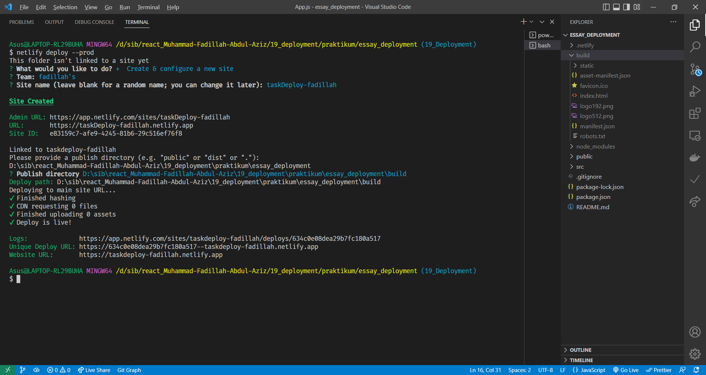
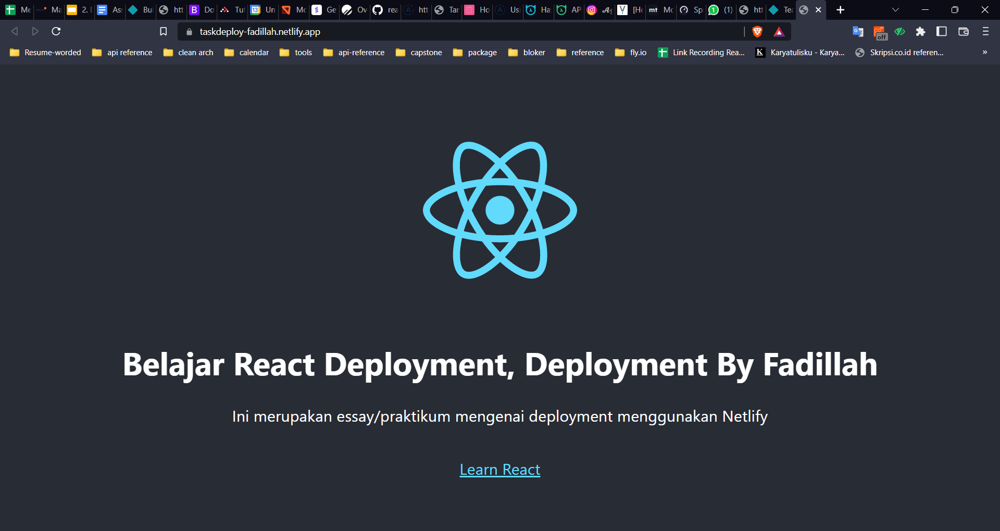

# Summary Deployment

###Build React App

Sebelum mendeploy aplikasi kita perlu mengkompilasi code dari React menjadi vanilla javascript/menjadi static dengan cara mengetik `npm run build` . Instruksi tersebut akan meminta react untuk membuat folder build yang berisi code kita dalam bentuk javascript yang sudah siap diupload ke server. Terdapat beberapa penyedia layanan hosting website seperti surge dan netlify (saya lebih memilih ini).

Untuk membuat website tersedia secara online melalui netlify, kita dapat menggunakan 3 cara yaitu dengan mengunggah langsung folder build ke website netlify, melalui repository git, dan menggunakan netlify CLI. Pada kali ini saya diminta untuk menggunakan netlify CLI. Hal yang pertama dilakukan adalah menginstal Netlify dengan menuliskan instruksi seperti berikut

## Deployment menggunakan Surge

1. Node versi terbaru
2. `npm install --global surge`
3. Jalankan perintah surge pada terminal

## Deployment dengan Netlify

1. ```
   npm install netlify-cli -g
   netlify deploy
   ```

2. lakukan autentifikasi di website netlify, kemudian lakukan beberapa konfigurasi dan build pada netlify CLI.

```powershell
netlify deploy --prod
```

## Praktikum Deployment Menggunakan Netlify

1. Install terlebih CLI Netlify `npm install netlify-cli -g`
2. Lalu `netlify deploy --prod`, Lalu Authorization menggunakan akun netlify yang sudah terdaftar
3. Lalu configurasi settingan deployment
   
4. Lalu setelah konfigurasi akan langsung dideploy ke server, dan berikut link-nya : **[taskdeploy-fadillah.netlify.app](https://taskdeploy-fadillah.netlify.app/)**
   
