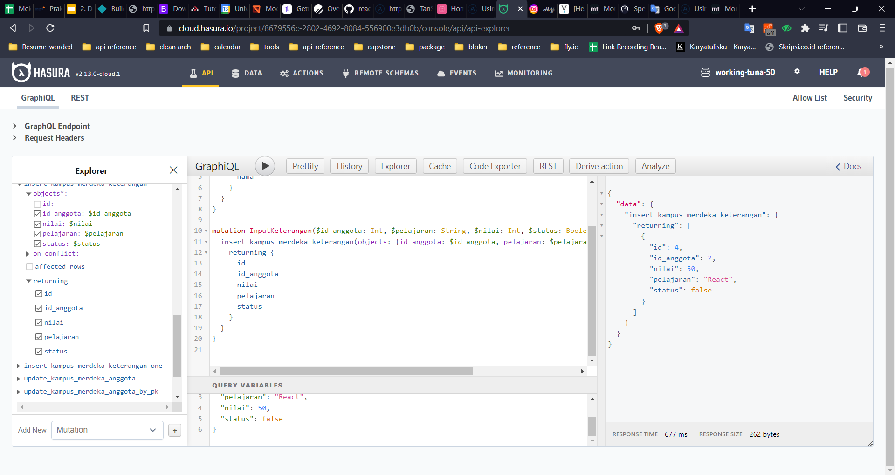

# Summary GraphQL Basic

## GraphQL

GraphQL merupakan bahasa query untuk API. GraphQL memungkinkan kita untuk mengambil data yang kita butuhkan hanya dengan satu end point.

GraphQL dapat dijalankan secara lokal dan dalam server. Untuk membuat GraphQL muncul di internet, kita dapat menggunakan Hasura dan Apollo server serta (Heroku + Neon) sebagai penyimpanan database. Hasura merupakan vendor graphQL dan rest api dalam bentuk cloud, sedangkan Heroku merupakan cloud PaaS yang biasa digunakan oleh backend developer untuk mempublikasikan codenya.

Fitur utama GraphQL:

1. Query: untuk mengambil data dengan query yang kita deklarasikan sebelumnya
2. Mutation: untuk input, delete, update data
3. Subscription: mengambil update data realtime / berbasis suatu event

Contoh GraphQL Query

```graphql
{
  query {
    movies {
      id
      title
      director {
        name
        age
      }
    }
  }
}
```

Contoh GraphQL Mutation

```graphql
mutation {
	insert_film{
		objects: {
			title: "Something",
			description: "New Movies",
		}
	}
	{
		returning {
			id
		}
	}
}
```

Contoh GraphQL Subscription

```graphql
subscription {
  person {
    id
    name
  }
}
```

## Praktikum

Praktikum ini merupakan essay mengenai graphQL basic

1. Pertama membuat schema bernama `kampus_merdeka`
2. membuat 2 table yang pertama table `anggota` dan kedua table `keterangan`
3. Input 3 data pada table anggota


4. Lalu masukan 4 keterangan



5. Membuat query yang memanggil anggota yang memiliki status true pada table keterangans


6. Melakukan Insert pada anggota ber-id 3 sebanyak 2 data


7. Melakukan mutation dengan update keterangan yang berstatus `false` menjadi `true`


