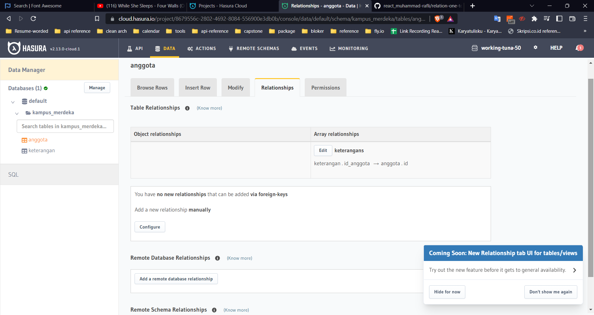
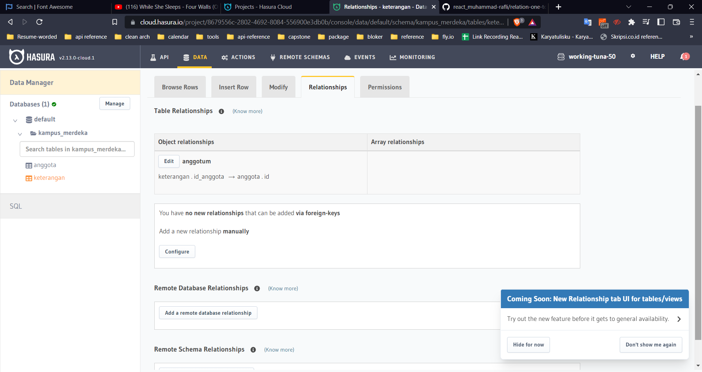
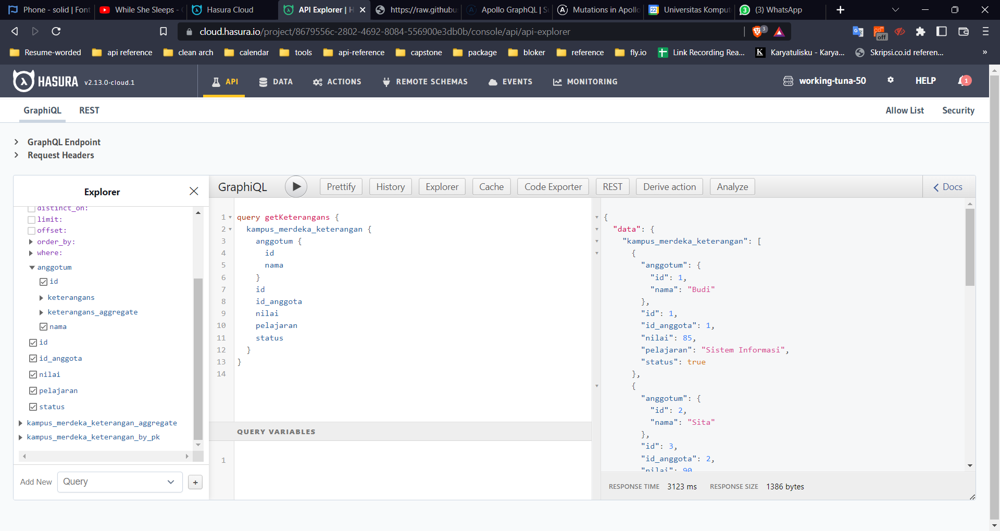
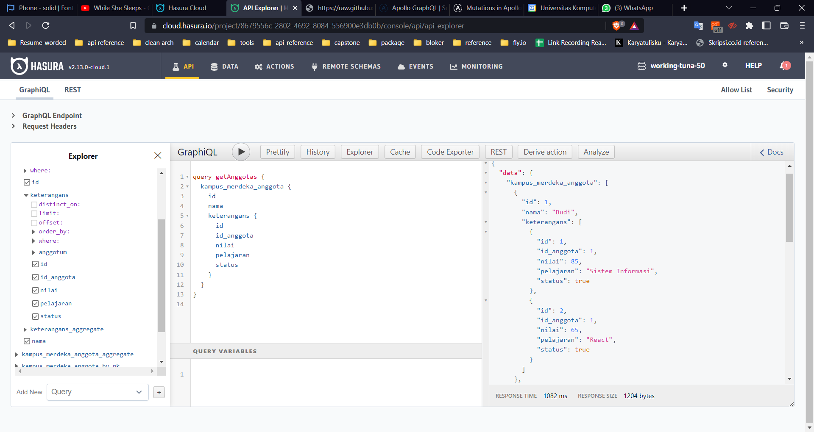

# Summary Relational Database

## Database

merupakan kumpulan data yang terorganisir. Database tersebut dapat dihubungkan dengan database lainnya dengan tiga jenis hubungan yaitu one to one, one to many, dan many to many.

Untuk mengimplementasikan relational database, kita dapat menggunakan macam RDMS seperti MySQL, PosgreSQL,dan MariaDB. tipe data pada MySQL adalah number, huruf, dan date.

Perintah SQL dapat dibagi menjadi tiga jenis yaitu:

- DDL (Data Definition Language) yang meliputi CREATE DATABASE, USE, CREATE TABLE, DROP TABLE, RENAME TABLE
- DML (Data Manipulation Language) yang meliputi INSERT, SELECT, UPDATE, DELETE, LIKE / BETWEEN, AND / OR, ORDER BY, LIMIT, INNER JOIN, LEFT JOIN, RIGHT JOIN, UNION
- DCL (Data Control Language)

# Praktikum

disini saya melakukan get keterangan dengan relasi one to many dengan anggota

1. result one keterangan to one anggota
   
2. result one anggota to many keterangans
   
