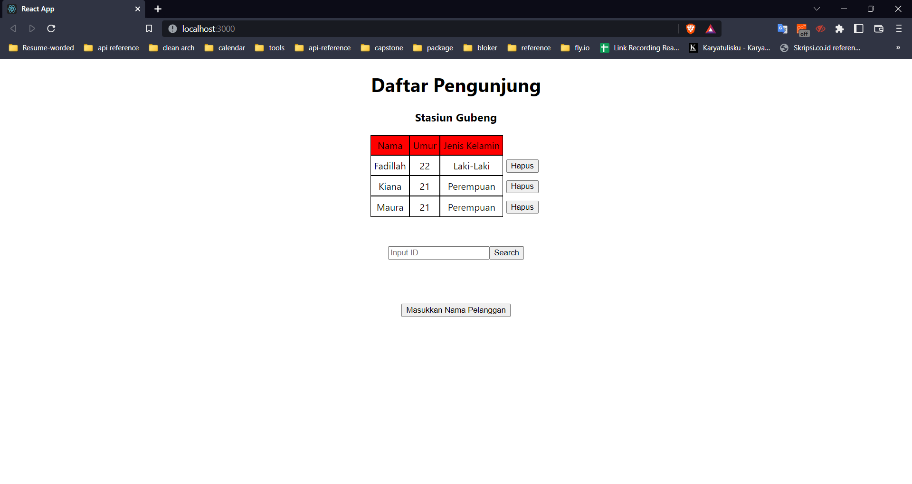
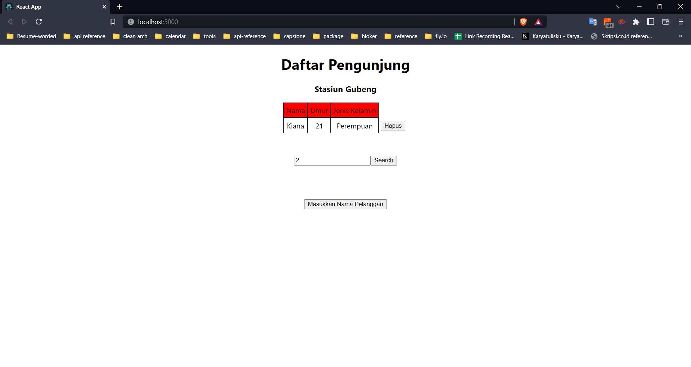

# Summary GraphQL Query and Apollo Client

Apollo Client merupakan library state management untuk javascript yang memungkinkan kita untuk menggunakan graphQL. Kita dapat menggunakannya untuk melakukan fetching, cache, dan memodifikasi data aplikasi sembari melakukan update UI secara otomatis. Kita dapat menggunakan apollo pada project react dan deployment menggunakan hasura.

Cara menginstall Apollo Client

- Buat project CRA `npx create-react-app project-name`
- Menambahkan library dengan mengetikkan ini pada terminal `npm install @apollo/client graphql` dan `npm install graphql `

Konsep Query dalam GraphQL adalah untuk menampilkan data. Untuk menampilkan data ke UI menggunakan Apollo client, kita perlu melakukan beberapa setup yaitu membuat satu file khusus untuk mengambil link API serta headers API. Kemudian kita menambahkan JSX Apollo Provider dengan props bernama client yang berisi function pada file sebelumnya.

3 Konsep Penting Query dengan Apollo Client:

- Query biasa: Otomatis langsung render data
- Lazy query: Nunggu action dari user seperti klik baru bisa render
- Refetching: refresh hasil query sebagai respon atas action dari user

# Praktikum

1. Menampilkan semua data di hasura menggunakan apollo client
   

2. Menampilkan data sesuai dengan id yang diinputkan users
   
