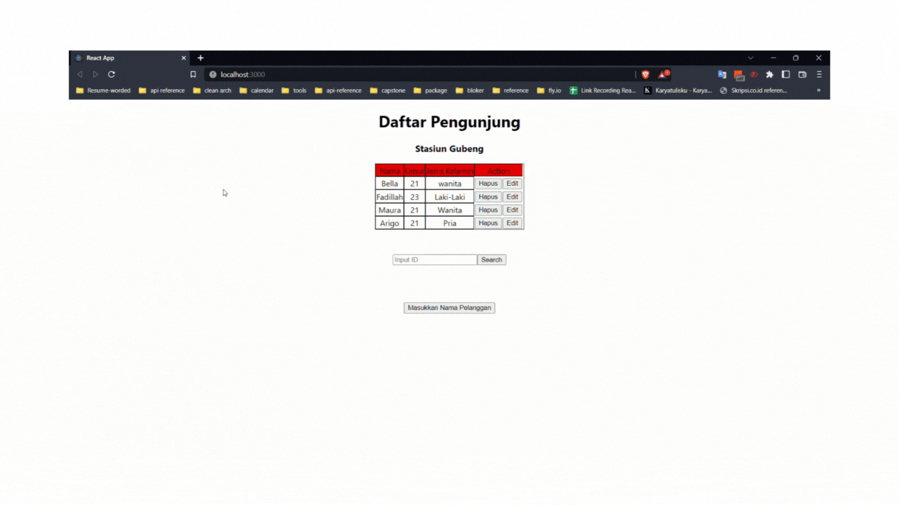

# Summray GraphQL - Mutation

## GraphQL Mutation

adalah suatu teknik untuk menulis kembali data ke server, Seperti Create, Update, dan Delete. Untuk implementasinya kita dapat menggunakan hooks useMutation dari apollo client.Dengan menggunakan mutation. Ketika ingin melakukan refetching menggunakan mutation, kita dapat menambahkan {refetchQueries: [QueryGraphQL] }.

Contoh dari Mutation

1. Create :
   ```graphql
   mutation InsertUsers($objects: [users_insert_input!] = {}) {
     insert_users(objects: $objects) {
       returning {
         id
       }
     }
   }
   ```
2. Delete :

   ```graphql
   mutation DeleteUsers($id: Int!) {
     delete_users_by_pk(id: $id) {
       id
     }
   }
   ```

3. Update :
   ```graphql
   mutation EditUser($id: Int!, $_set: users_set_input = {}) {
     update_users(where: { id: { _eq: $id } }, _set: $_set) {
       returning {
         id
       }
     }
   }
   ```

# Praktikum

**Berikut Hasil Membuat Create, Delete, dan Update pada essay sectio 23**

