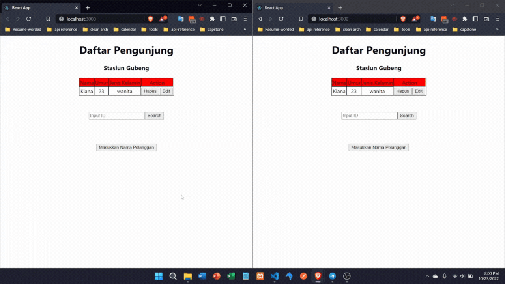

# Summary GraphQL Subscriptions

Selain Queries dan Mutations, GraphQL juga mendukung operasi lain yang bernama Subsicriptions. Subscriptions ini memungkinkan kita untuk fetching data secara berkala (update). Mereka dapat mempertahankan koneksi aktif ke server graphQL melalui websocket sehingga memungkinkan server untuk mengupdate ke hasil subscription.

**Subscription** sangat berguna untuk memberi tahu client secara real time terkait perubahan data di back-end. Subscription cocok digunakan ketika menemui kondisi sebagai berikut:

- Ada perubahan kecil atau incremental pada object yang besar.
- Real time update dengan latensi rendah. contohnya pada aplikasi chat

Library yang dapat digunakan dalam subscription ada 2 yaitu **subscriptions-transport-ws** dan **graphql-ws**. Untuk kali ini saya membuat subscription dengan library kedua.

contoh code subscriptions

```graphql
subscription MySubscription {
  passenger {
    id
    jenis_kelamin
    nama
    umur
  }
}
```

# Praktikum

Berikut hasil dari implemntasi saya mengenai subscriptions :


